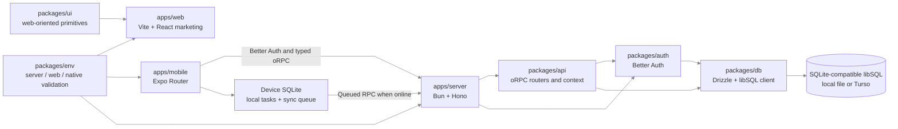
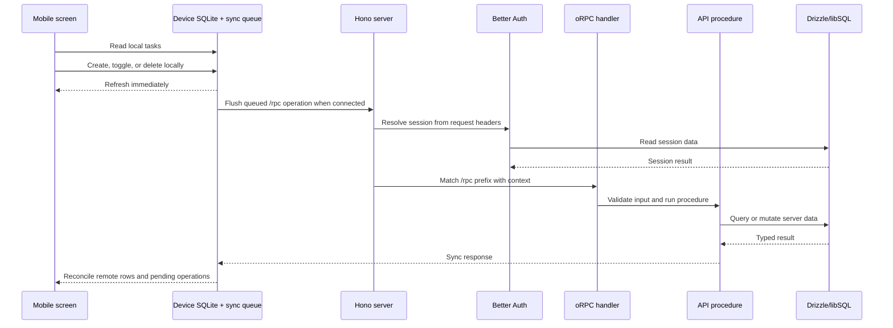
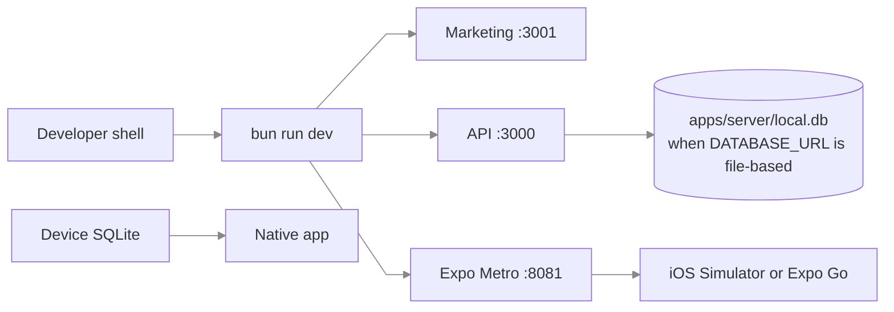

# Architecture

## Boundaries

The repository contains one native product client, one marketing-only web client, one HTTP server, and shared packages. The native app is the only client that currently consumes the server API. It keeps a local SQLite task store and sync queue for offline use; the server keeps the shared SQLite-compatible libSQL database.

`apps/web` is a product preview and marketing surface. It does not provide web task editing and does not currently call the API or Better Auth endpoints. Keep web-specific marketing composition in `apps/web`; use the shared UI package for reusable web primitives.

The server-side packages are the only code that accesses the server database. The mobile client intentionally accesses its own on-device SQLite database through `apps/mobile/lib/local-db.ts`; that database is not the server database.

## HTTP and sync flows

### Native task flow

Authentication uses `POST`/`GET /api/auth/*` and is handled by Better Auth. API traffic uses `/rpc/*`; the generated API reference is served under `/api-reference/*`. RevenueCat sends purchase lifecycle events to `POST /webhooks/revenuecat`.

`publicProcedure` is available without a session. `protectedProcedure` checks the Better Auth session and throws `UNAUTHORIZED` when no authenticated user is present. `subscription.status` and `privateData` are protected. The current todo procedures remain public and are not user-scoped; this is suitable for the development example only.

### Web flow

The current web route renders a static marketing page with a device preview. It does not load or mutate tasks, authenticate users, or depend on a live server. `VITE_SERVER_URL` is retained in the web environment contract for future API-backed web work but is not consumed by the current route.

## Runtime configuration

Each runtime validates its own environment surface:

- Server: `DATABASE_URL`, `DATABASE_AUTH_TOKEN`, `BETTER_AUTH_SECRET`, `BETTER_AUTH_URL`, `CORS_ORIGIN`, `NODE_ENV`, and optional `REVENUECAT_WEBHOOK_SECRET`.
- Web: `VITE_SERVER_URL` (declared but currently unused by the marketing route).
- Native: `EXPO_PUBLIC_SERVER_URL`, `EXPO_PUBLIC_REVENUECAT_APPLE_API_KEY`, and `EXPO_PUBLIC_REVENUECAT_GOOGLE_API_KEY`.

The mobile example also reads optional `EXPO_PUBLIC_TERMS_URL` and `EXPO_PUBLIC_PRIVACY_URL` directly from the Expo environment for Settings links; those two values are not part of the native Zod environment schema yet.

The server loads `apps/server/.env` through `dotenv`. Vite loads `apps/web/.env`, and Expo loads `apps/mobile/.env`. All `EXPO_PUBLIC_*` and `VITE_*` values are public and must never contain credentials.

## Development topology

`bun run dev` starts the web, server, and native workspace dev tasks through Turborepo. For focused work, use separate terminals with `bun run dev:server`, `bun run dev:web`, and `bun run dev:native -- --ios`. The server listens on `:3000`; Vite is configured for `:3001`; Expo normally uses Metro on `:8081`.

For a production-like server, `apps/server/Dockerfile` builds the server bundle and Docker Compose supplies runtime environment variables. A hosted Turso/libSQL database should be used for deployed workloads. The mobile database remains an on-device cache and outbox in every environment.

## Change seams

| Concern | Change here | Avoid changing |
| --- | --- | --- |
| Native screen and route UI | `apps/mobile/app`, `apps/mobile/components` | API or database internals |
| Native local task state and sync | `apps/mobile/lib/local-db.ts`, `apps/mobile/stores/todo-store.ts` | Treating the server as the immediate UI source of truth |
| Marketing web page | `apps/web/src/routes`, `apps/web/src/index.css` | Adding web task editing without an explicit product decision |
| Shared web visual primitives | `packages/ui` and `docs/DESIGN.md` | Duplicating web primitives in the app |
| Client/server contract | `packages/api/src/routers` | Ad hoc fetch shapes in clients |
| Authentication | `packages/auth`, mobile auth client | Reading session data directly from the database |
| Persistence | `packages/db/src/schema`, `packages/db/src/subscriptions.ts` | Embedding SQL in route components |
| Runtime configuration | `packages/env` and app `.env.example` files | Exposing server secrets to clients |
