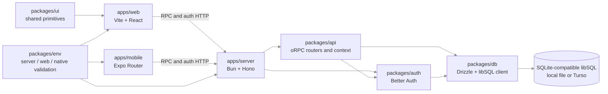
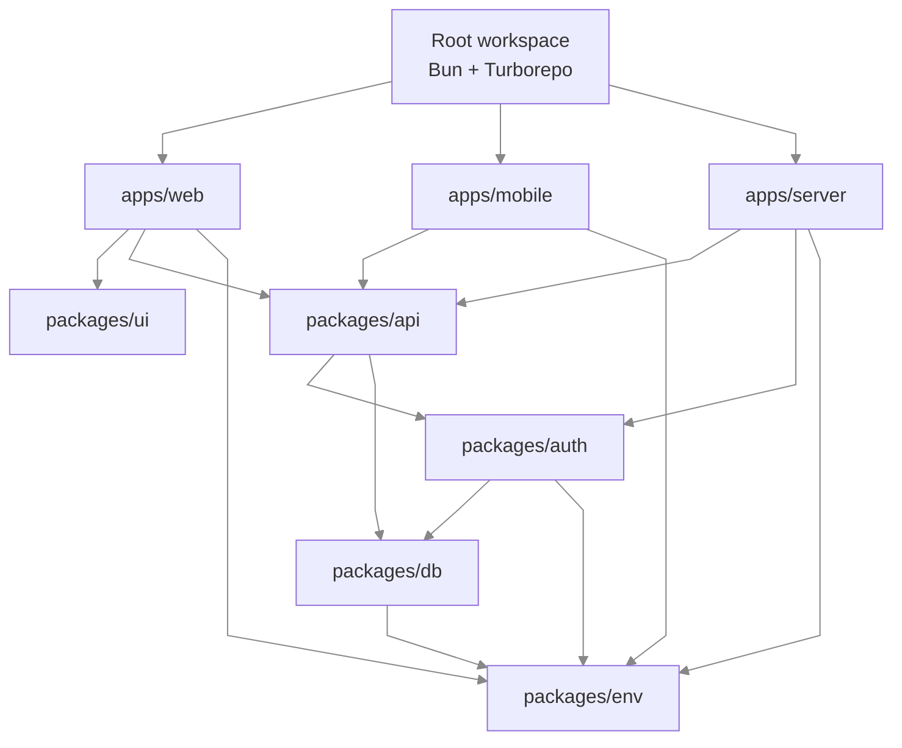
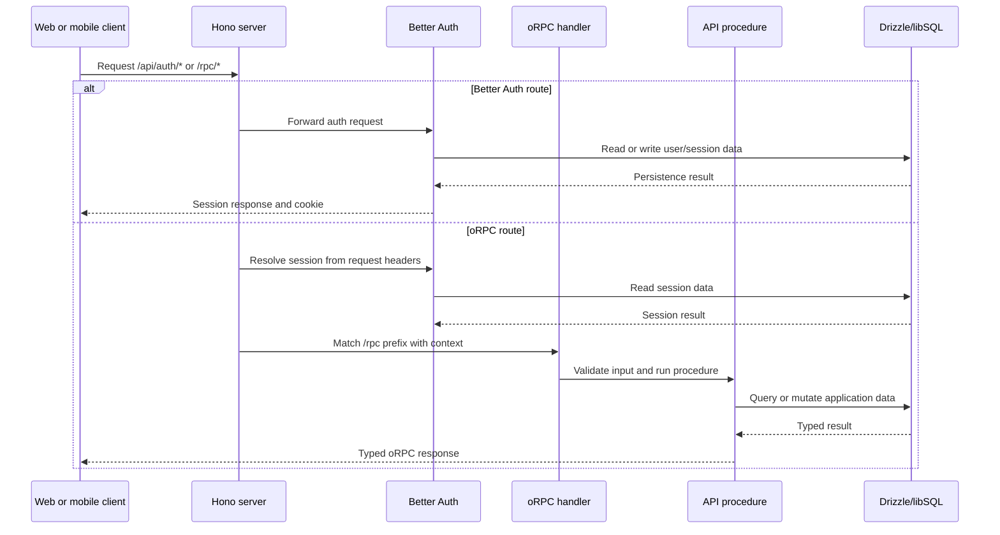
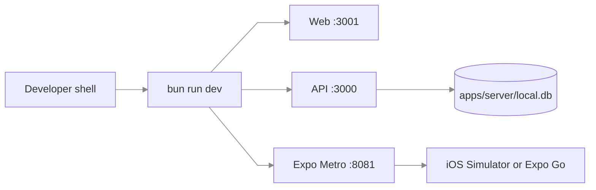

# Architecture

## Overview

The repository is a workspace of two clients, one HTTP server, and shared packages. Both clients call the same typed oRPC procedures and Better Auth endpoints; only the server-side packages talk to the database.

## Workspace dependency direction

The dependency direction is intentionally simple: clients depend on typed contracts, the server composes the HTTP boundary, and persistence stays behind `packages/db`.

## HTTP request flow

`publicProcedure` is available without a session. `protectedProcedure` applies the session middleware and throws `UNAUTHORIZED` when no authenticated user is present. The current todo procedures are public; private application procedures should use the protected variant.

## Runtime configuration

Each runtime validates only its own environment surface:

- Server: `DATABASE_URL`, `DATABASE_AUTH_TOKEN`, `BETTER_AUTH_SECRET`, `BETTER_AUTH_URL`, and `CORS_ORIGIN`.
- Web: `VITE_SERVER_URL`.
- Native: `EXPO_PUBLIC_SERVER_URL`.

The server loads `apps/server/.env` through `dotenv`. Vite loads `apps/web/.env`, and Expo loads `apps/mobile/.env`. Public client variables must never contain credentials.

## Development topology

For a production-like server, the `apps/server/Dockerfile` builds the server bundle and Docker Compose supplies runtime environment variables. A hosted Turso/libSQL database should be used for deployed workloads.

## Change seams

| Concern | Change here | Avoid changing |
| --- | --- | --- |
| Screen and route UI | `apps/web/src/routes`, `apps/mobile/app` | API or database internals |
| Shared visual primitives | `packages/ui` and `docs/DESIGN.md` | Duplicating primitives in each app |
| Client/server contract | `packages/api/src/routers` | Ad hoc fetch shapes in clients |
| Authentication | `packages/auth`, auth clients | Reading session data directly from the database |
| Persistence | `packages/db/src/schema` and migrations | Embedding SQL in route components |
| Runtime configuration | `packages/env` and app `.env.example` files | Exposing server secrets to clients |
