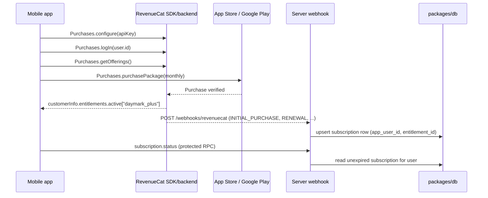

# In-app purchases (RevenueCat)

Daymark Plus uses [RevenueCat](https://www.revenuecat.com/) (`react-native-purchases`) for a store-backed auto-renewing subscription. RevenueCat wraps StoreKit and Google Play Billing, verifies receipts server-side, and mirrors lifecycle events to this app's server through webhooks. The paywall is intentionally isolated at `apps/mobile/app/paywall.tsx`; the rest of the app only needs to react to the resulting entitlement.

## How access is granted

RevenueCat is the source of truth for store transactions; this repo's server persists the entitlement state and exposes it to signed-in clients. The current example does not enforce a task limit or gate another premium feature yet.



## Local setup

### Mobile

Copy `apps/mobile/.env.example` to `apps/mobile/.env` and set the RevenueCat public SDK keys:

```bash
EXPO_PUBLIC_REVENUECAT_APPLE_API_KEY=...
EXPO_PUBLIC_REVENUECAT_GOOGLE_API_KEY=...
```

These are **public** keys (RevenueCat "App specific keys" under Project settings → API keys). They only identify the app; they cannot change subscription state. Never put the RevenueCat webhook secret or any private key in `EXPO_PUBLIC_*`.

The SDK entitlement identifier `daymark_plus` (`apps/mobile/constants/purchases.ts`) must match an entitlement in the RevenueCat dashboard. Purchases are driven by the **current offering**; the paywall prefers the monthly package and falls back to the first available package when no monthly package is configured.

Because RevenueCat is a native module, Expo Go cannot run real purchases (it runs in Preview API Mode). Use a development build:

```bash
bun run dev:native -- --ios
```

### RevenueCat dashboard

1. Create a project and connect the iOS (App Store) and Android (Google Play) apps. The bundle identifiers must match `apps/mobile/app.json`.
2. Create the subscription product(s) in each store and mirror them in RevenueCat products.
3. Create a `daymark_plus` entitlement and attach the products to it.
4. Create an offering containing the monthly package.
5. Add a webhook to `https://<your-server>/webhooks/revenuecat` with the shared secret.

### Server

Copy `apps/server/.env.example` to `apps/server/.env` and set the webhook secret:

```bash
REVENUECAT_WEBHOOK_SECRET=...
```

The endpoint authenticates with `Authorization: Bearer <secret>`. Apply the schema first:

```bash
bun run db:push
bun run dev:server
```

## Runtime flow

1. `useRevenueCatBootstrap` links RevenueCat to `user.id` when a Better Auth session exists, so the webhook's `app_user_id` can equal the local user id. The paywall configures the native SDK before loading offerings for an anonymous user.
2. The paywall (`usePaywallPurchases`) fetches `getOfferings()`, shows the monthly package price, and reads `customerInfo.entitlements.active` for the current status.
3. The CTA calls `purchasePackage`. RevenueCat presents the platform sheet, verifies the purchase, and finishes the transaction; no manual transaction finishing is needed.
4. Restore calls `restorePurchases()`.
5. RevenueCat sends lifecycle webhooks (`INITIAL_PURCHASE`, `RENEWAL`, `EXPIRATION`, ...) to the server, which upserts the current state into the `subscription` table (idempotent by event id).
6. `subscription.status` (protected oRPC procedure) returns the persisted entitlement for the signed-in user. `usePlusEntitlement` accepts that server status and falls back to the local RevenueCat SDK state while webhook processing or authentication is incomplete.

## Webhook behavior

- Route: `POST /webhooks/revenuecat` in `apps/server/src/webhooks/revenuecat.ts`.
- Auth: `Authorization: Bearer ${REVENUECAT_WEBHOOK_SECRET}` (503 if the secret is not configured).
- Persists only subscription lifecycle events that carry an `entitlement_ids` entry; other events are acknowledged with `200`.
- Idempotent: RevenueCat retries reuse the same `event.id`, which is stored as `last_event_id`; duplicates are ignored.
- `EXPIRATION` revokes access immediately; `CANCELLATION` keeps access until the period ends (RevenueCat sends `EXPIRATION` after any grace period).
- The row is linked to a local user when `app_user_id` matches a Better Auth user id (true after `Purchases.logIn`).
- When a webhook contains multiple entitlement IDs, the current handler persists the first one only.

## Testing

- RevenueCat Test Store: use a Test Store API key in the SDK config to test purchases end-to-end without App Store Connect or Google Play Console setup.
- iOS sandbox: configure the subscription in App Store Connect and test with a Sandbox Apple ID.
- Webhook: send a sample payload with `curl` and confirm the `subscription` row updates:

```bash
curl -X POST http://localhost:3000/webhooks/revenuecat \
  -H "Authorization: Bearer $REVENUECAT_WEBHOOK_SECRET" \
  -H "Content-Type: application/json" \
  -d '{"event":{"id":"evt_test_1","type":"INITIAL_PURCHASE","app_user_id":"<user-id>","product_id":"com.daymark.plus.monthly","entitlement_ids":["daymark_plus"],"store":"APP_STORE","environment":"SANDBOX","period_type":"NORMAL","purchased_at_ms":1,"expiration_at_ms":<future-ms>},"api_version":"1.0"}'
```

## Production notes

- Register the webhook secret via environment configuration only (never `EXPO_PUBLIC_*`, never commit `.env`).
- The webhook accepts both SANDBOX and PRODUCTION events. Before launch, filter `environment === "PRODUCTION"` if you do not want sandbox test purchases to grant access.
- RevenueCat receipts are verified by RevenueCat; the server trusts the authenticated webhook as the entitlement boundary. Add optional HMAC verification if you want defense-in-depth beyond the bearer secret.
- No task-creation limit or other premium capability is currently enforced after entitlement lookup; add that policy explicitly in the API and local write path before describing it as a paid boundary.
- Store dashboard configuration (real product ids, matching bundle ids, test vs production API keys) is an operator task, not code.

## Out of scope / follow-ups

- RevenueCat hosted Paywalls (`react-native-purchases-ui`) are not used; the custom Daymark paywall remains.
- Web purchases (RevenueCat Billing) are not configured; purchases are iOS/Android only.
- The `subscription` table is the entitlement source of truth. A denormalized `is_plus` column on the Better Auth user can be added later if user queries need it.
